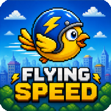

```
▄▄▄▄▄▄▄ ▄▄▄     ▄▄▄ ▄▄▄ ▄▄▄▄▄ ▄▄▄ ▄▄▄ ▄▄▄▄▄▄▄      ▄▄▄▄▄▄▄ ▄▄▄▄▄▄▄ ▄▄▄▄▄▄▄ ▄▄▄▄▄▄▄ ▄▄▄▄▄▄ 
█ ▄▄▄▄█ █ █     █▄▀█▀▄█ █▄ ▄█ █ ▀██ █ █ ▄▄▄▄█      █ ▄▄▄▄█ █ ▄▄▄ █ █ ▄▄▄▄█ █ ▄▄▄▄█ █ ▄▄ ▀█
█ ▄▄█   █ █▄▄▄▄  ▀█ █▀  ▄█ █▄ █ █▄▀ █ █ █▄▄ █      █▄▄▄▄ █ █ ▄▄▄▄█ █ ▄▄▄█▄ █ ▄▄▄█▄ █ █▄▀ █
█▄█     █▄▄▄▄▄█   █▄█   █▄▄▄█ █▄█▀█▄█ █▄▄▄▄▄█      █▄▄▄▄▄█ █▄█     █▄▄▄▄▄█ █▄▄▄▄▄█ █▄▄▄▄█▀
```


Flying Speed is a fun game where you control a bird and try to go as far as possible while dodging obstacles.

It is written in C++ and SDL2. The play area is **720x720** (1:1) and it starts in **fullscreen**.


## Controls

| Key | Action |
| --- | --- |
| `Space`, up arrow, `W` or `K` | Fly / start / restart |
| `P` | Pause |
| `Esc` | Quit |
| Gamepad (A, B, D-pad up, left stick up) | Fly / start / restart |
| Gamepad Start | Pause |
| Gamepad Back | Quit |

Mappings from `assets/gamecontrollerdb.txt` are loaded at startup (PS3/4/5, Xbox, Switch, 8BitDo, THEGamepad, Arduino Leonardo, etc. on Linux).

## Requirements

- CMake 3.16+
- C++17
- SDL2, SDL2_image, SDL2_ttf, SDL2_mixer
- pkg-config

### Debian 12 (aarch64 or amd64)

```bash
sudo apt update
sudo apt install build-essential cmake pkg-config \
    libsdl2-dev libsdl2-image-dev libsdl2-ttf-dev libsdl2-mixer-dev
```

### macOS (Homebrew)

```bash
brew install cmake sdl2 sdl2_image sdl2_ttf sdl2_mixer pkg-config
```

## Build and run

```bash
cmake -S . -B build -DCMAKE_BUILD_TYPE=Release -DCMAKE_PREFIX_PATH=/usr
cmake --build build -j1
./build/flying-speed
```

Options:

```bash
./build/flying-speed --windowed   # 720x720 development window
./build/flying-speed --help
```

## Install (Linux)

```bash
sudo make install          # installs to /usr/local by default
```

This installs:

| What | Where |
| --- | --- |
| Binary | `/usr/local/bin/flying-speed` |
| Assets | `/usr/local/share/flying-speed/assets/` |
| Desktop entry | `/usr/local/share/applications/flying-speed.desktop` |
| Icon | `/usr/local/share/icons/hicolor/192x192/apps/flying-speed.png` |

Custom prefix:

```bash
sudo make install PREFIX=/usr
```

To remove everything:

```bash
sudo make uninstall
```

## Asset lookup

Assets are looked up in this order:

1. `FLYING_SPEED_ASSETS`
2. `assets/` next to the executable
3. `../assets`
4. `/usr/local/share/flying-speed/assets`
5. `/usr/share/flying-speed/assets`

## Sound

- `assets/background.ogg` looping background music (low volume)
- `assets/flap.flac` when flying (Space)
- `assets/pass.mp3` when passing through a pipe
- `assets/collide.wav` when hitting a pipe or the screen edge
